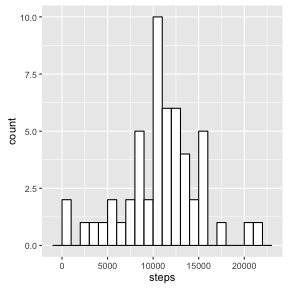
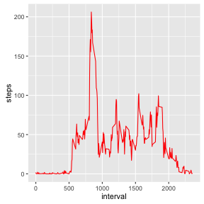
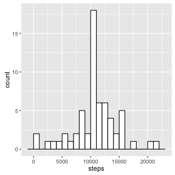
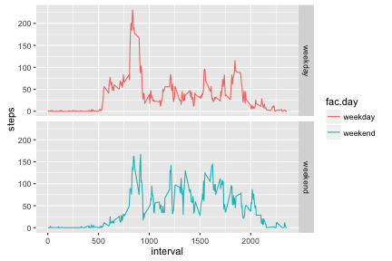

## Loading and preprocessing the data
First we load the data:

```r
setwd("~/repos/RepData_PeerAssessment1/")
activity <- read.csv(unz("activity.zip", "activity.csv"))
```
We use the *ggplot2* and *dplyr* libraries.

Then we process the data to turn the date variable from factor into Date class:


```r
activity <- mutate(activity, date = as.Date(date))
```

## What is mean total number of steps taken per day?
Using aggregate function, we calculate the number of steps taken each day

```r
tot.steps <- aggregate(steps ~ date, data = activity, sum)
```

Next, we plot the histogram of the number os steps taken each day:

```r
g1 <- ggplot(tot.steps, aes(steps)) 
g1 <- g1 + geom_histogram(color="black",fill="white", binwidth = 1000)
g1
```

 

Mean and median of number of steps taken per day are calculated as:

```r
steps.mean   <- mean(tot.steps$steps, na.rm=TRUE)
steps.median <- median(tot.steps$steps, na.rm=TRUE)
c(steps.mean, steps.median)
```

```
## [1] 10766.19 10765.00
```

## What is the average daily activity pattern?
Now we compute in 5-minute intervals,  the average number of steps taken, across all days and plot the results:

```r
tmstp <- aggregate(steps ~ interval, data = activity, mean)
# Plot
g2 <- ggplot(tmstp, aes(x = interval, y = steps))
g2 <- g2 + geom_line(color="red")
g2
```

 

The 5-minute interval with the maximum number of steps on average is given by

```r
tmstp[which.max(tmstp$steps), ]
```

```
##     interval    steps
## 104      835 206.1698
```
which is the 835th interval.

## Imputing missing values

There are missing values (NA) in the steps variabe of the data. The number of them is:

```r
sum(is.na(activity$steps))
```

```
## [1] 2304
```
We can impute the missing values with the mean for the 5-minute intervals that they belong to (which is computed from the rest of the data):


```r
# Compute mean steps taken for each five-minute interval across all days
mean.intervals <- tapply(activity$steps, activity$interval, mean, na.rm = TRUE)
# Create a data frame from mean.intervals
df.intervals <- data.frame(interval = as.numeric(names(mean.intervals)),av.steps = mean.intervals)
# Indices of the NA columns
index.na <- which(is.na(activity$steps))
# Join activity and df.intervals by interval
activity <- inner_join(activity, df.intervals, "interval" )
# Replace NA steps with averaged ones
activity[index.na, 1] <- activity[index.na, 4]
# No need for the av.steps column
activity <- select(activity, 1:3)
```

Now, we can plot a new histogram from the imputed data frame:

```r
tot.steps <- aggregate(steps ~ date, data = activity, sum)
g3 <- ggplot(tot.steps, aes(steps)) 
g3 <- g3 + geom_histogram(color="black",fill="white", binwidth = 1000)
g3
```

 

New mean and median of number of steps taken per day is given by:

```r
steps.mean   <- mean(tot.steps$steps)
steps.median <- median(tot.steps$steps)
c(steps.mean, steps.median)
```

```
## [1] 10766.19 10766.19
```

The mean stayed the same but median got slighlty higher. In the new data, mean and median are equal.

## Are there differences in activity patterns between weekdays and weekends?

To check for differences in activity patterns between weekdays and weekends, we create the function to find the factor which the date belongs to and apply it on the 
data frame:

```r
f.wk <- function(t) {ifelse(t %in% c("Saturday", "Sunday"), "weekend", "weekday")}
activity <- mutate(activity, fac.day = factor(f.wk(weekdays(date))) )
```
 
Finally, we plot the time series plot for weekday and weekend activities:

```r
tmstp <- aggregate(steps ~ interval + fac.day, data = activity, mean)
g4 <- ggplot(tmstp, aes(x = interval, y = steps))
g4 <- g4 + geom_line(aes(color=fac.day)) + facet_grid(fac.day~.)
g4
```

 

There seems to be a large peak around 835 steps during weekdays (maybe related to people taking a walk to get to work), while on weekends the number of steps are rather equally spread out. 
